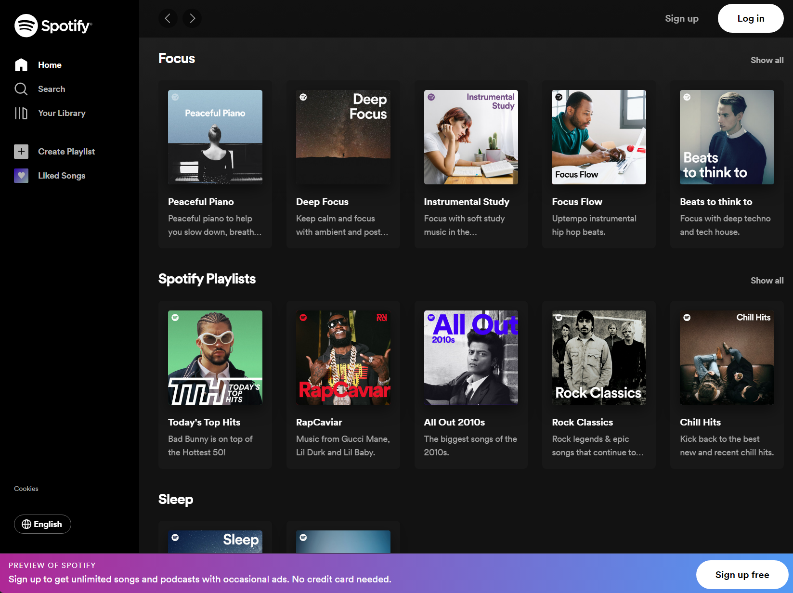

# Spotify Clone

This project is a work-in-progress Spotify clone, built using React. The goal of this project is to showcase my skills as a developer and create a replica of the popular music streaming platform, Spotify, with as close to 1:1 functionality as possible.

Please note that this project is currently under development, and not all features are fully implemented. I am actively working on enhancing the functionality and adding new features to make the clone as close to the original Spotify as possible.

## Table of Contents

- [Features](#features)
- [Installation](#installation)
- [Usage](#usage)
- [Technologies Used](#technologies-used)
- [Contributing](#contributing)
- [License](#license)

## Features

The aim of this Spotify clone is to replicate the core features of the original Spotify platform. 

As this project is a work in progress, not all features might be fully implemented or functional at the moment. However, I am actively working on developing and enhancing the clone to ensure it provides a similar experience to the original Spotify platform.

## App Functionality 
- Language selection from English or French - Managed by Redux
- Searching [In progress]
- Favourites [In progress]
- Unit testing [In Progress] - Written using Jest

## Installation

To run this project locally, follow these steps:

1. Clone the repository: `git clone https://github.com/your-username/spotify-clone.git`
2. Navigate to the project directory: `cd spotify-clone`
3. Install the dependencies: `npm install`
4. Start the development server: `npm start`

## Usage

Once the development server is up and running, open your web browser and navigate to `http://localhost:3000` to access the Spotify clone. From there, you can explore the available features and functionalities.

## Technologies

- React
- Redux
- JavaScript
- HTML
- CSS
- Multiple API's for artwork and music

## License

This project is licensed under the [MIT License](LICENSE). Feel free to modify and distribute this code as needed.
